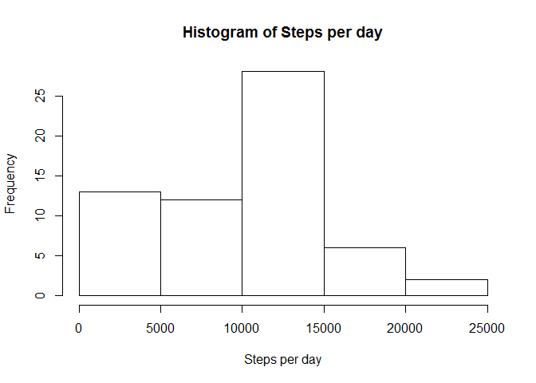
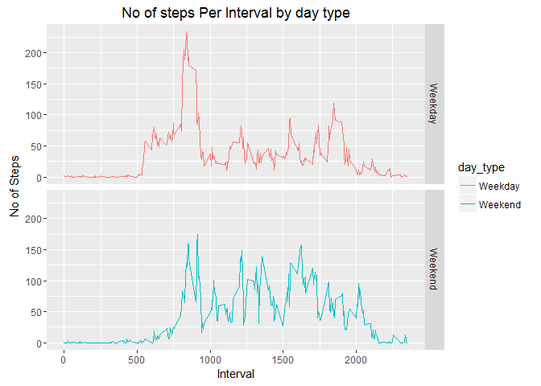

Reading in the data, loading libraries

    activity<-read.csv("activity.csv")
    library(ggplot2)

    ## Warning: package 'ggplot2' was built under R version 3.2.5

Q1.What is mean total number of steps taken per day?
====================================================

For this part of the assignment, you can ignore the missing values in
the dataset.

Calculate the total number of steps taken per day If you do not
understand the difference between a histogram and a barplot, research
the difference between them. Make a histogram of the total number of
steps taken each day Calculate and report the mean and median of the
total number of steps taken per day

Finding steps per day:

    View(activity)
    perdaysteps<-tapply(activity$steps, activity$date, sum, na.rm=TRUE)

Plotting histogram of steps/day

    hist(perdaysteps, xlab="Steps per day", main="Histogram of Steps per day")

Finding mean and median

    meansteps<-mean(perdaysteps)
    mediansteps<-median(perdaysteps)
    print("Mean and median respectively are "); meansteps; mediansteps

    ## [1] "Mean and median respectively are "

    ## [1] 9354.23

    ## [1] 10395

Q2. What is the average daily activity pattern?
===============================================

Make a time series plot (i.e. type = "l") of the 5-minute interval
(x-axis) and the average number of steps taken, averaged across all days
(y-axis)

Which 5-minute interval, on average across all the days in the dataset,
contains the maximum number of steps?

    # preprocessing data for plot
    steps_by_interval <- aggregate(steps ~ interval, activity, mean)

    # create a time series plot 
    plot(steps_by_interval$interval, steps_by_interval$steps, type='l', 
         main="Average number of steps over all days", xlab="Interval", 
         ylab="Average number of steps")

    # find row with max of steps
    max_steps_row <- which.max(steps_by_interval$steps)

    # find interval with this max
    steps_by_interval[max_steps_row, ]

    ##     interval    steps
    ## 104      835 206.1698

Q.3. Imputing missing values
============================

Note that there are a number of days/intervals where there are missing
values (coded as NA). The presence of missing days may introduce bias
into some calculations or summaries of the data.

Calculate and report the total number of missing values in the dataset
(i.e. the total number of rows with NAs)

Devise a strategy for filling in all of the missing values in the
dataset. The strategy does not need to be sophisticated. For example,
you could use the mean/median for that day, or the mean for that
5-minute interval, etc. Create a new dataset that is equal to the
original dataset but with the missing data filled in.

Make a histogram of the total number of steps taken each day and
Calculate and report the mean and median total number of steps taken per
day. Do these values differ from the estimates from the first part of
the assignment? What is the impact of imputing missing data on the
estimates of the total daily number of steps?

    sum(is.na(activity))

    ## [1] 2304

There are 2304 missing values

Filling in the NA's with mean for 5 minute interval

    data_imputed <- activity
    for (i in 1:nrow(data_imputed)) {
      if (is.na(data_imputed$steps[i])) {
        interval_value <- data_imputed$interval[i]
        steps_value <- steps_by_interval[
          steps_by_interval$interval == interval_value,]
        data_imputed$steps[i] <- steps_value$steps
      }
    }
    # calculate  total number of steps taken each day
    df_imputed_steps_by_day <- aggregate(steps ~ date, data_imputed, sum)

    #Plotting Histogram
    hist(df_imputed_steps_by_day$steps, main="Histogram of total number of steps per day (imputed)", 
         xlab="Total number of steps in a day")

    # get mean and median of imputed data
    mean(df_imputed_steps_by_day$steps)

    ## [1] 10766.19

    median(df_imputed_steps_by_day$steps)

    ## [1] 10766.19

There is a slight difference in Median

Q.4 Are there differences in activity patterns between weekdays and weekends?
=============================================================================

For this part the weekdays() function may be of some help here. Use the
dataset with the filled-in missing values for this part.

Create a new factor variable in the dataset with two levels - "weekday"
and "weekend" indicating whether a given date is a weekday or weekend
day.

Make a panel plot containing a time series plot (i.e. type = "l") of the
5-minute interval (x-axis) and the average number of steps taken,
averaged across all weekday days or weekend days (y-axis).

See the README file in the GitHub repository to see an example of what
this plot should look like using simulated data.

Function to determine if weekday

    week_day <- function(date_val) {
        wd <- weekdays(as.Date(date_val, '%Y-%m-%d'))
        if  (!(wd == 'Saturday' || wd == 'Sunday')) {
            x <- 'Weekday'
        } else {
            x <- 'Weekend'
        }
        x
    }

Plotting the graph

    # Apply the week_day function and add a new column to activity dataset
    activity$day_type <- as.factor(sapply(activity$date, week_day))

    #load the ggplot library
    library(ggplot2)

    # Create the aggregated data frame by intervals and day_type
    steps_per_day_impute <- aggregate(steps ~ interval+day_type, activity, mean)

    # Create the plot
    plt <- ggplot(steps_per_day_impute, aes(interval, steps)) +
        geom_line(stat = "identity", aes(colour = day_type)) +
        theme_gray() +
        facet_grid(day_type ~ ., scales="fixed", space="fixed") +
        labs(x="Interval", y=expression("No of Steps")) +
        ggtitle("No of steps Per Interval by day type")
    print(plt)

